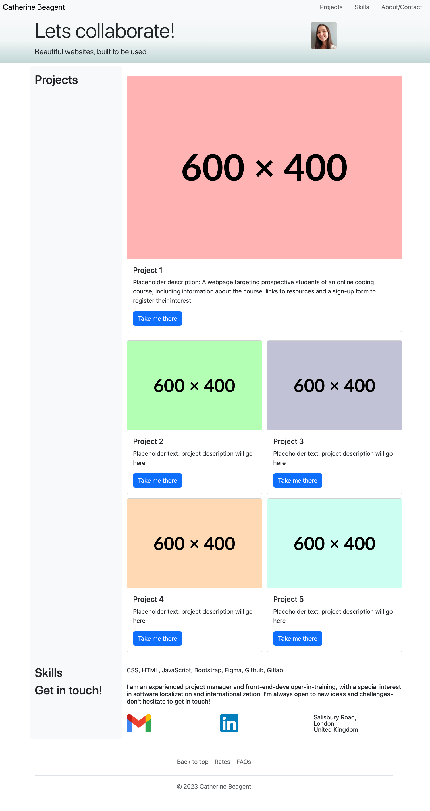

# Catherine Beagent Web Development Portfolio (Bootstrap)

## Description

This project's goal was to recreate an [earlier portfolio](https://cgbea.github.io/cbeagent-portfolio/) showcasing my web development experience to prospective employers, using Bootstrap classes in place of my own style.css file wherever possible. The website is a responsive portfolio, including a hero, links to my work (or placeholders for future projects), information about me, contact information and a footer. It will be updated as my skills progress.

## Installation
n/a

## Usage

The website can be publically accessed at https://cgbea.github.io/cbeagent-portfolio/. 

## Credits
The project brief was provided by edX as part of its Skills for Life front-end skills course. HTML and CSS techniques learned from [Bootstrap documentation](https://getbootstrap.com/), [W3Schools](https://www.w3schools.com/) and [mdn web docs](https://developer.mozilla.org/en-US/docs/Learn) were used in the making of this website. The Linkedin Icon was made available on [this page] (https://brand.linkedin.com/policies#:~:text=If%20you%20have%20a%20current,the%20terms%20of%20the%20agreement). and any icons were sourced from [Font Awesome](https://fontawesome.com/).

## License
MIT License

Copyright (c) 2023 cgbea

Permission is hereby granted, free of charge, to any person obtaining a copy
of this software and associated documentation files (the "Software"), to deal
in the Software without restriction, including without limitation the rights
to use, copy, modify, merge, publish, distribute, sublicense, and/or sell
copies of the Software, and to permit persons to whom the Software is
furnished to do so, subject to the following conditions:

The above copyright notice and this permission notice shall be included in all
copies or substantial portions of the Software.

THE SOFTWARE IS PROVIDED "AS IS", WITHOUT WARRANTY OF ANY KIND, EXPRESS OR
IMPLIED, INCLUDING BUT NOT LIMITED TO THE WARRANTIES OF MERCHANTABILITY,
FITNESS FOR A PARTICULAR PURPOSE AND NONINFRINGEMENT. IN NO EVENT SHALL THE
AUTHORS OR COPYRIGHT HOLDERS BE LIABLE FOR ANY CLAIM, DAMAGES OR OTHER
LIABILITY, WHETHER IN AN ACTION OF CONTRACT, TORT OR OTHERWISE, ARISING FROM,
OUT OF OR IN CONNECTION WITH THE SOFTWARE OR THE USE OR OTHER DEALINGS IN THE
SOFTWARE.
